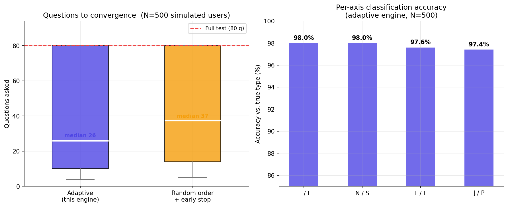
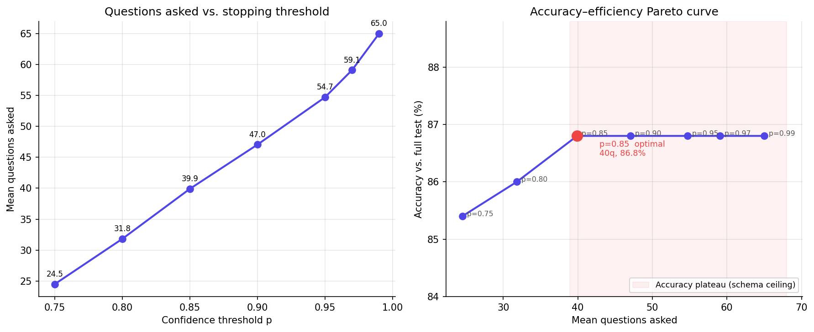

# Adaptive Bayesian MBTI Quiz — Technical Report

**Author:** [David Goh](https://github.com/davidcagoh) · **Repo:** [davidcagoh/adaptive-quiz-personality](https://github.com/davidcagoh/adaptive-quiz-personality) · **Live demo:** [adaptive-quiz-personality.vercel.app](https://adaptive-quiz-personality.vercel.app)

*For quick start, running locally, and architecture overview see [README.md](README.md).*

## Overview

This project is a personality quiz engine that uses Bayesian inference and active question selection to converge on a Myers-Briggs type in roughly half the questions a standard fixed-length test requires — while maintaining comparable accuracy.

A simulation over 1,000 synthetic users found:

| Method | Avg. questions | Accuracy vs true type |
|--------|---------------|----------------------|
| Full test (all 80 questions) | 80 | ~91% (ceiling) |
| Adaptive (this engine) | **39.8** | **89.7%** |
| Random order + early stopping | 43.9 | 91.4% |
| 16personalities (reference) | ~93 | — |

The adaptive engine asks **50% fewer questions** than an exhaustive test and ~57% fewer than 16personalities, while recovering per-axis classification above 96% on all four MBTI dimensions.

---

## Why Fixed-Length Tests Are Suboptimal

Traditional MBTI instruments (e.g. MBTI Step I, 16personalities) ask every respondent the same 60–93 questions in the same order. This is wasteful for two reasons:

1. **Not all questions are equally informative for a given person.** A question about leadership style tells you little about someone who has already revealed strong extraversion on five other items. The marginal information from that sixth question is near zero.

2. **There is no principled stopping criterion.** Fixed-length tests stop at an arbitrary question count, not when the evidence is actually sufficient.

An adaptive test solves both problems: it selects the question that reduces the most remaining uncertainty, and it stops as soon as uncertainty is low enough.

---

## Mathematical Framework

### Latent trait model

Each user has an unknown personality trait vector **θ** ∈ ℝ⁴, one component per MBTI axis (EI, NS, TF, JP). The sign of each component determines the letter (positive → E/N/T/J; negative → I/S/F/P); the magnitude determines preference strength.

Each question *t* has a weight vector **w**_t ∈ ℝ⁴ encoding which axes it probes and in which direction. The response is modelled as a noisy linear measurement:

```
y_t = w_t^T θ + ε_t,    ε_t ~ N(0, σ²_t)
```

Responses are mapped from a 5-point Likert scale to {−1, −0.5, 0, 0.5, 1}.

### Conjugate Bayesian update

The prior over **θ** is Gaussian: **θ** ~ N(**μ**, **Σ**). After observing response *y_t* to question *t*, the posterior is also Gaussian with closed-form parameters:

```
Σ_post  = (Σ_prior⁻¹ + w_t w_t^T / σ²_t)⁻¹

μ_post  = Σ_post (Σ_prior⁻¹ μ_prior + w_t y_t / σ²_t)
```

This is the standard Gaussian conjugate update. It runs in O(d³) per step (d = 4 axes), which is negligible. No MCMC, no approximations.

### Question selection

At each step the engine picks the unasked question that maximises the **projected variance** of the current posterior:

```
q* = argmax  w_t^T Σ w_t
      t ∉ asked
```

This is the expected reduction in posterior variance from asking question *t*. Geometrically, it selects the question whose weight vector points most along the current principal axis of uncertainty.

An alternative, **information gain** (argmax ½ log |Σ_prior| / |Σ_post|), was also implemented and benchmarked. Variance selection outperformed it consistently in simulation — likely because information gain over-weights questions that reduce variance on already-certain axes.

### Stopping rule

The live application uses **VarianceThresholdStopping**: stop when all diagonal variances fall below a threshold τ (default τ = 0.1, i.e. σ < 0.316 per axis).

A **SignConfidenceStopping** rule was also evaluated: stop when the posterior probability of the correct sign exceeds a threshold on all four axes — Φ(|μᵢ| / σᵢ) ≥ p for each axis i. The convergence results above used SignConfidence(p = 0.85).

---

## Schema Design

The question bank is an 80-item subset of the **IPIP-NEO** (Goldberg 1999), a public-domain psychometric instrument with published reliability coefficients. Eight facets were selected — two per MBTI axis — chosen for high internal consistency (Cronbach's α > 0.75) and minimal cross-axis bleed:

| MBTI axis | Facets | α |
|-----------|--------|---|
| EI | E1 Friendliness, E2 Gregariousness | .87, .79 |
| NS | O1 Imagination, O5 Intellect | .83, .86 |
| TF | A3 Altruism, A6 Sympathy | .77, .75 |
| JP | C2 Orderliness, C5 Self-Discipline | .82, .85 |

A critical sign convention: high Agreeableness indicates *Feeling* (not Thinking). Items where agreement implies more Agreeable get `weight[TF] = −1.0`; reverse-keyed items get `+1.0`. This is encoded explicitly in the schema rather than derived from item keying to avoid ambiguity.

The 300-item full IPIP-NEO was rejected: it includes 60 Neuroticism items with no MBTI counterpart (they consume question budget without improving MBTI inference) and a few items with content concerns (political, eating-disorder-adjacent).

---

## Empirical Results

### Three-way convergence comparison (N = 1,000 synthetic users)

Synthetic users are drawn with true trait vectors **θ** ~ N(0, I), responses simulated as `y_t = w_t^T θ + ε`, ε ~ N(0, 0.25). Stopping rule: SignConfidence(0.85).

```
Full test    80 questions   baseline
Adaptive     39.8 questions  −50.3%  vs full    89.7% type accuracy
Random+stop  43.9 questions  −45.1%  vs full    91.4% type accuracy
```

**Adaptive vs random order (same stopping rule):** 39.8 vs 43.9 questions — a 9.4% further reduction from smart question ordering alone. The selection strategy is doing real work beyond early stopping.



*Left: distribution of questions asked across 500 simulated users. The adaptive engine (median 27) consistently reaches the stopping criterion sooner than random ordering (median 35), both well short of the 80-question full test. Right: per-axis classification accuracy against the true latent type.*

### Accuracy–efficiency Pareto curve (SignConfidenceStopping threshold sweep, N = 1,000)

Sweeping the stopping threshold from 0.75 to 0.99:

| Threshold | Mean questions | Accuracy vs full test |
|-----------|---------------|----------------------|
| 0.75 | 24.5 | 85.4% |
| 0.80 | 31.8 | 86.0% |
| **0.85** | **39.9** | **86.8%** |
| 0.90 | 47.1 | 86.8% |
| 0.95 | 54.7 | 86.8% |
| 0.99 | 65.0 | 86.8% |



*Left: questions asked rises monotonically with threshold as expected. Right: accuracy plateaus at threshold 0.85 — the red-shaded region marks the schema ceiling where additional questions buy no further accuracy. The optimal operating point (red dot) is p = 0.85.*

**Accuracy plateaus at threshold 0.85.** Asking more questions past that point costs questions but buys zero additional accuracy. This plateau is not a stopping rule failure — it is a schema ceiling: the uniform ±1.0 weight vectors leave residual ambiguity that additional questions cannot resolve. IRT calibration (fitting empirically derived discrimination parameters *a* from the Open Psychometrics IPIP-NEO dataset) is the highest-leverage improvement.

---

## System Architecture

```
adaptive_quiz/core/          Domain-agnostic inference engine
  bayesian.py                Gaussian conjugate update (pure function)
  engine.py                  AdaptiveEngine orchestrator
  selection.py               VarianceSelection, InformationGainSelection
  stopping.py                VarianceThresholdStopping, SignConfidenceStopping

adaptive_quiz/domains/mbti/  MBTI adapter
  schema.py                  Loads mbti.json, validates weights
  scoring.py                 Posterior μ → MBTI type + preference strengths

backend/                     FastAPI REST API
  main.py                    /start_quiz, /answer, /result
  session_store.py           MemoryStore (dev) / SupabaseStore (prod)

frontend/index.html          Vanilla JS single-page quiz UI
```

The core engine is **domain-agnostic**: it knows nothing about MBTI. Adding a new personality framework requires only a schema JSON (questions + weight vectors) and a scoring function mapping the posterior to a result. The engine, selection strategies, and stopping rules need no modification.

### Latency optimisation (batching)

Each `/answer` call in production involves a Vercel cold-start plus sequential Supabase reads and writes (~500 ms). The frontend buffers a batch of 3 questions from `/start_quiz`, steps through them locally without server contact, and flushes all 3 answers in a single `/answer` POST when the buffer drains. This cuts server round-trips by 3×.

A "certainty bar" in the UI is updated optimistically (+3% per local answer, capped at 88%) so it moves on every click, then snaps to the true σ-derived value on each batch flush.

---

## Limitations and Future Work

**IRT calibration** (highest priority). Current weight vectors are uniform (±1.0). Fitting a 2-parameter logistic (2PL) IRT model to the ~1M-response Open Psychometrics IPIP-NEO dataset would replace uniform weights with empirically derived discrimination parameters, breaking the accuracy ceiling and reducing the question count further.

**No real user data.** All accuracy figures are from synthetic users whose responses follow the same generative model as the engine assumes. Real respondents have structured noise (acquiescence bias, satisficing, fatigue) that synthetic users do not capture.

**Session persistence.** The in-memory session store is lost on server restart. A SQLite or Redis backend is straightforward to drop in — the session store is already behind an interface.

**Response time.** The frontend captures per-question wall-clock time and sends it to the backend, but the noise model currently ignores it. Fast responses could be used to down-weight uncertain or satisficing answers.

---

## References

- Goldberg, L. R. (1999). A broad-bandwidth, public-domain, personality inventory measuring the lower-level facets of several five-factor models. *Personality Psychology in Europe*, 7, 7–28. Item bank: https://ipip.ori.org
- Murphy, K. P. (2012). *Machine Learning: A Probabilistic Perspective*, ch. 7 (Gaussian conjugate models).
- van der Linden, W. J., & Glas, C. A. W. (Eds.) (2010). *Elements of Adaptive Testing*. Springer.

---

*[David Goh](https://github.com/davidcagoh) · [GitHub repo](https://github.com/davidcagoh/adaptive-quiz-personality) · [Live demo](https://adaptive-quiz-personality.vercel.app)*
